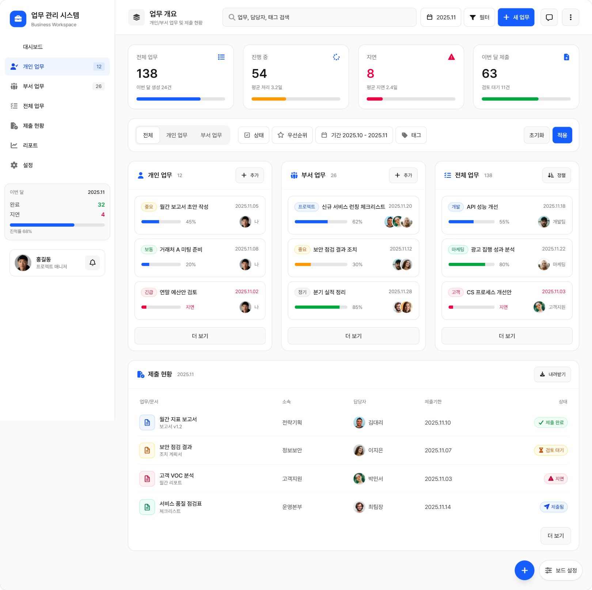

# 업무 일감 관리 시스템

개인 업무와 부서 업무를 통합적으로 관리할 수 있는 웹 기반 업무 관리 시스템입니다.



## 🎯 주요 기능

- **개인/부서 업무 관리** - 업무 생성, 수정, 삭제 및 할당
- **대시보드** - 실시간 통계 및 업무 현황 모니터링
- **업무 제출 및 승인** - 제출/승인/반려 워크플로우
- **통계 및 분석** - 업무 진행 상황 시각화
- **검색 및 필터링** - 다양한 조건으로 업무 검색

## 🛠️ 기술 스택

### Frontend
- Next.js 15 (App Router) + TypeScript
- TailwindCSS + Lucide React Icons
- Zustand (State Management)
- Recharts (Data Visualization)

### Backend
- FastAPI + Python 3.8+
- JSON File-based Database
- JWT Authentication
- OpenAPI (Swagger) Documentation

## 🚀 빠른 시작

### 필수 요구사항
- Python 3.8 이상
- Node.js 18+ (Frontend용)
- npm

### 빠른 시작 ⚡ (추천)
```bash
# 1. 저장소 클론
git clone <repository-url>
cd TaskManagement

# 2. Backend 설정 및 실행
cd backend
python3 -m venv venv
source venv/bin/activate  # Windows: venv\Scripts\activate
pip install -r requirements.txt
python main.py

# 3. Frontend 설정 및 실행 (새 터미널)
cd frontend
npm install
npm run dev
```

완료!
- **Frontend**: http://localhost:3000
- **Backend API**: http://localhost:3001/api
- **API Docs**: http://localhost:3001/api/docs

### 환경 변수 설정 (선택)
Backend에 `.env` 파일을 생성하여 설정을 변경할 수 있습니다:
```bash
cd backend
cp .env.example .env
# 필요에 따라 .env 파일 수정
```

## 📚 상세 문서

### 프로젝트 문서
- **[docs/PRD.md](./docs/PRD.md)** - 제품 요구사항 정의서
- **[docs/plan.md](./docs/plan.md)** - 상세 기술 구현 계획
- **[docs/IMPLEMENTATION.md](./docs/IMPLEMENTATION.md)** - 단계별 구현 가이드
- **[docs/CLAUDE.md](./docs/CLAUDE.md)** - 개발 가이드라인 및 베스트 프랙티스

### 개발 문서
- **[backend/README.md](./backend/README.md)** - 백엔드 상세 문서
- **[frontend/README.md](./frontend/README.md)** - 프론트엔드 상세 문서

## 📂 프로젝트 구조
```
TaskManagement/
├── backend/          # NestJS 백엔드
├── frontend/         # Next.js 프론트엔드
├── docs/             # 프로젝트 문서
├── logs/             # 개발 서버 로그
├── dev.sh            # 개발 스크립트
└── UI.png            # UI 디자인 참고
```

## 🧪 빌드
```bash
# 프론트엔드 빌드
cd frontend && npm run build

# 백엔드는 Python 스크립트로 별도 빌드 불필요
```

## 🚀 배포
간편하게 무료로 배포하기:
- **빠른 시작**: [DEPLOYMENT-QUICKSTART.md](./DEPLOYMENT-QUICKSTART.md) (5분)
- **상세 가이드**: [DEPLOYMENT.md](./DEPLOYMENT.md)
- **플랫폼**: Vercel (Frontend) + Railway (Backend + PostgreSQL)

## 📄 라이선스
MIT License

## 📞 문의
문제가 발생하거나 기능 제안이 있으시면 이슈를 생성해주세요.

---

**버전**: 1.0
**최종 업데이트**: 2025-11-13
